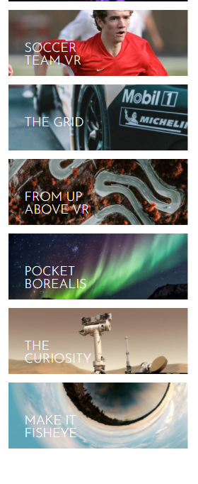
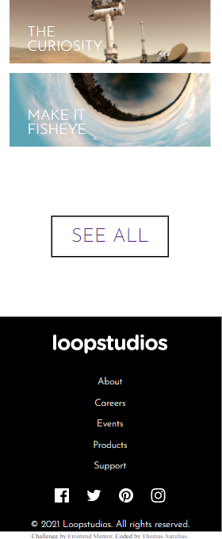

# Frontend Mentor - Loopstudios landing page solution

This is a solution to the [Loopstudios landing page challenge on Frontend Mentor](https://www.frontendmentor.io/challenges/loopstudios-landing-page-N88J5Onjw). Frontend Mentor challenges help you improve your coding skills by building realistic projects.

## Table of contents

-  [Overview](#overview)
   -  [The challenge](#the-challenge)
   -  [Screenshot](#screenshot)
   -  [Links](#links)
-  [My process](#my-process)
   -  [Built with](#built-with)
   -  [What I learned](#what-i-learned)
   -  [Continued development](#continued-development)
-  [Author](#author)
-  [Acknowledgments](#acknowledgments)

## Overview

### The challenge

Users should be able to:

-  View the optimal layout for the site depending on their device's screen size
-  See hover states for all interactive elements on the page

### Screenshot

### Links

-  Solution URL: (https://github.com/ThomasAurelius/fm_loopstudios-landing-page-main/blob/master/README-template.md)
-  Live Site URL: [Add live site URL here](https://your-live-site-url.com)

## My process

### Built with

-  Semantic HTML5 markup
-  CSS custom properties
-  Flexbox
-  Mobile-first workflow

### What I learned

Containers are your friend!

### Continued development

Possible tweak section 2 a little bit to make the inbetween sizes look a little more polished.
Also, the active/hover states on the li's. The images from the documents show a shorter line than what I have made and I need to fiddle with it. Probably using ::after

### Useful resources

## Author

-  Website - [Thomas Aurelius](https://www.thomasaurelius.com)
-  Frontend Mentor - [@thomasaurelius](https://www.frontendmentor.io/profile/thomasaurelius)
-  Twitter - [@thomasaurelius4](https://www.twitter.com/yourusername)

## Acknowledgments

Thank you frontendmentor for the challenge, and Kevin Powell for all the CSS videos!
